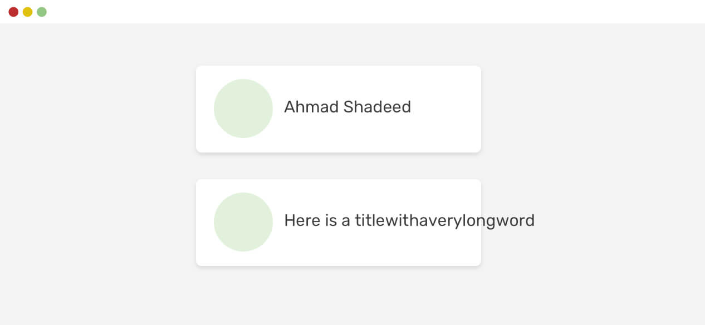
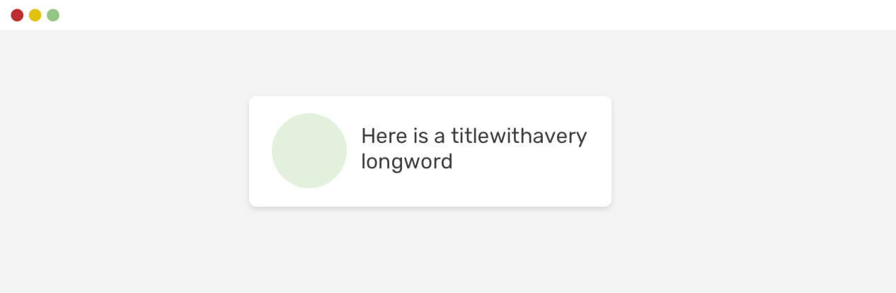

# flex
## flex item不换行

如果一个item有一个比自身大的文本元素或图像，浏览器不会缩小它们。这是 flexbox 的默认行为。  

  

即使使用了`overflow-wrap: break-word`也不行。

```css
.card__title {
    overflow-wrap: break-word;
}
```

要更改该默认行为，我们需要将item的`min-width`设置为`0`。

```css
.card__title {
    overflow-wrap: break-word;
    min-width: 0;
}
```


